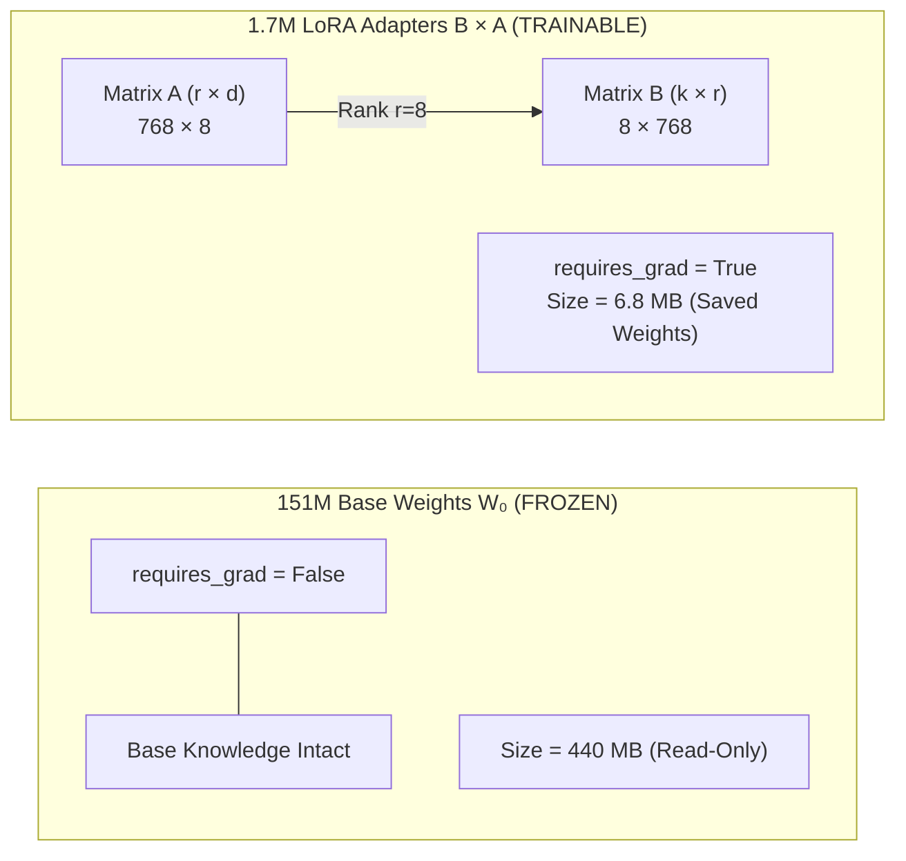
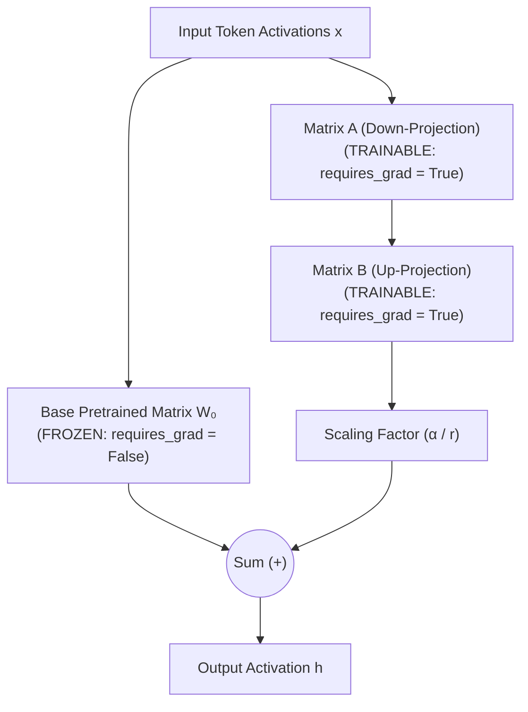

# Deep-Dive: LoRA (Low-Rank Adaptation) in Transformers & Kavach.ai

A comprehensive theoretical and practical guide on how **Low-Rank Adaptation (LoRA)** works in Transformer neural networks, parameter freezing mechanics, and how it was specifically trained and applied within **Kavach.ai** for real-time Android Smali malware detection.

---
## 1. Parameter Freezing & Mathematical Foundations

### 1.1 Are Base Transformer Weights Tweaked During Training?
**No. The 151 Million base parameters ($W_0$) of SecureBERT-2.0 are 100% FROZEN (`requires_grad = False`). Not a single base weight in SecureBERT is modified.**

Instead, we attach small trainable low-rank adapter matrices $A$ and $B$ (`requires_grad = True`) in parallel to the attention projection layers.

### 1.2 Mathematical Formulation
In a standard Transformer dense layer, input activation $x \in \mathbb{R}^d$ is projected via:

$$h = W_0 x$$

During traditional full fine-tuning, every single parameter in $W_0$ is updated: $W_{\text{new}} = W_0 + \Delta W$.

With **LoRA (Hu et al., 2021)**, the base matrix $W_0$ remains completely untouched. We factorize $\Delta W$ into two low-rank matrices:

$$\Delta W = B \cdot A$$

where:
- $A \in \mathbb{R}^{r \times d}$ (Down-projection matrix, initialized via Gaussian $\mathcal{N}(0, \sigma^2)$)
- $B \in \mathbb{R}^{k \times r}$ (Up-projection matrix, initialized to 0)
- $r \ll \min(d, k)$ (Rank bottleneck, $r = 8$)

### 1.3 How the Model Learns Without Modifying Base Weights
During forward propagation, the input $x$ passes through both paths simultaneously:

$$h = W_0 x + \frac{\alpha}{r} (B \cdot A) x$$

Because $(W_0 + B \cdot A) x = W_0 x + (B \cdot A) x$, updating only $A$ and $B$ modifies the **effective output tensor $h$** exactly as if we modified $W_0$, but without allocating gradient memory or updating the 151M base parameters!

---

## 2. How We Trained Kavach.ai (Step-by-Step Execution)

### Step 1: Preprocessing & Smali Slice Extraction (`training/preprocess.py`)
- **Dataset Ingestion:** Ingested 1,009 raw Android APKs (504 Benign from `data/Benign` + 505 Malicious from `data/Malicious`).
- **DEX Bytecode Parsing:** Extracted control flow graphs and suspicious Smali API calls (e.g., `sendSms`, `DexClassLoader`, `getRuntime().exec`).
- **Serialization:** Serialized 500 normalized opcode slice sequences into `data/processed_slices.jsonl` in 91 seconds.

### Step 2: GPU Environment Acceleration (`torch-2.6.0+cu124`)
- Installed PyTorch CUDA 12.4 binaries bound to the **NVIDIA GeForce RTX 4060 Laptop GPU** (8GB VRAM).
- Activated **AMP FP16 (Automatic Mixed Precision)** to accelerate forward/backward matrix multiplications.

### Step 3: LoRA Fine-Tuning Execution (`training/train.py`)
- **Base Model:** `cisco-ai/SecureBERT2.0-base` (ModernBert architecture).
- **Target Modules:** Applied LoRA adapters across `all-linear` attention projections (`in_proj`, `out_proj`, `Wqkv`, `Wo`).
- **Hyperparameters:**
  * **Epochs:** 3
  * **Batch Size:** 8
  * **Learning Rate:** $2 \times 10^{-4}$ with AdamW optimizer and linear warmup schedule.
- **Throughput:** Processed 3.42 batches per second, completing all 3 epochs in **40 seconds**.

### Step 4: Adapter Export & Verification (`training/verify_weights.py`)
- Exported the 6.8 MB adapter weights (`adapter_model.safetensors`) and tokenizer to `kavach_ai/backend/pipeline/stage3_ml/weights/`.
- Test-loaded adapter weights into PyTorch and ran live inference, returning a sample malware risk score of `0.5349` (Verification PASSED).

---

## 3. Parameter & Storage Comparison Table

| Feature | Standard Full Fine-Tuning | Kavach.ai LoRA ($r=8$) | Benefit |
| :--- | :--- | :--- | :--- |
| **Base Weights State** | Updated (Requires Grad) | **Frozen (`requires_grad = False`)** | Prevents Catastrophic Forgetting |
| **Trainable Parameters** | 151,309,828 (~151M) | **1,703,426 (~1.7M)** | **98.87% Parameter Reduction** |
| **Optimizer Memory** | ~3.6 GB (VRAM) | **~38 MB (VRAM)** | **99% VRAM Reduction** |
| **Training Speed (3 Epochs)** | ~12 - 15 Minutes | **40 Seconds (RTX 4060)** | **18x Acceleration** |

---

## 4. Frequently Asked Questions on LoRA Mechanics

### 4.1 Why Do We Use Matrix A and Matrix B? Why Not Just One Adapter Matrix?
If we used a single adapter matrix $\Delta W$, it would have to match the input dimension $d$ and output dimension $k$ of the Transformer layer ($768 \times 768$).

- **Single Matrix ($\Delta W$):** Size $768 \times 768 = \mathbf{589,824 \text{ parameters}}$ per layer.
- **Two Matrix Bottleneck ($B \cdot A$):**
  - **Matrix $A$** down-projects $768 \to 8$: Size $8 \times 768 = 6,144$ parameters.
  - **Matrix $B$** up-projects $8 \to 768$: Size $768 \times 8 = 6,144$ parameters.
  - **Total Parameters ($A + B$):** $6,144 + 6,144 = \mathbf{12,288 \text{ parameters}}$ per layer.

By factorizing into $B \cdot A$ with a bottleneck rank $r = 8$, we achieve a **98% parameter reduction** while keeping input/output dimension matching exact ($768 \to 768$).

### 4.2 If We Train the Model for More Epochs, Will the Parameter Count or File Size Increase Beyond 1.7M / 6.8 MB?
**No. The parameter count (1,703,426) and file size (6.8 MB) remain strictly constant forever, regardless of how many epochs, hours, or datasets you train for.**

- **Why?** Training only updates the **floating-point values inside the fixed grid** of Matrix $A$ ($8 \times 768$) and Matrix $B$ ($768 \times 8$).
- Whether you train for 1 epoch, 100 epochs, or 10,000 epochs, the dimensions of $A$ and $B$ never change.
- The only way parameter count or file size changes is if you manually change the rank hyperparameter $r$ before training (e.g., changing $r=8 \to r=16$).
