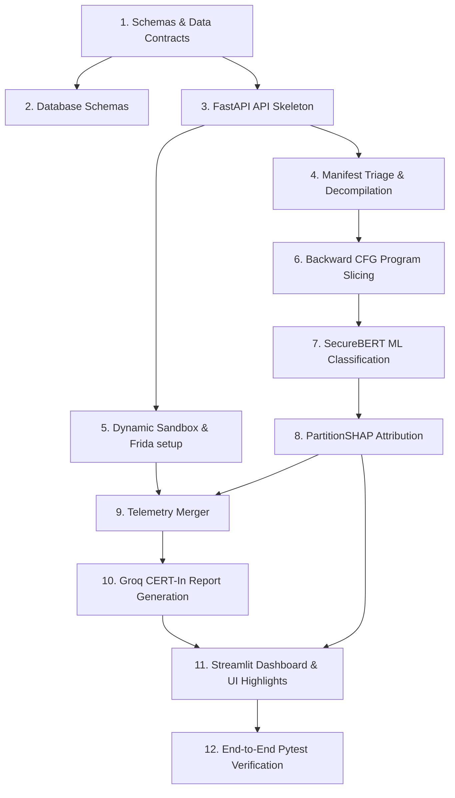

# Kavach.ai: Team Integration Roadmap & Dependency Tree

> **FOR THE LLM:** This document outlines the chronological execution order and dependency relationships between all four developer tracks. Use this guide to determine when to use **Mock Data** and when to use **Real Integrations** during code generation.

---

## 🗺️ Chronological Dependency Tree

---

## 📅 Phased Integration Timeline

### 🛠️ Phase 1: Contracts & Database (Days 1 - 2)
* **Goal:** Define the standard inputs/outputs so everyone can code without blocking each other.
* **Core Tasks:**
  * **[Pranav Krishna / Track 3]** Define Pydantic contracts in `kavach_ai/backend/app/schemas/contracts.py`.
  * **[Pranav Krishna / Track 3]** Initialize database state schemas (`apks`, `static_results`, `dynamic_results`).
  * **[Pranav Krishna / Track 3]** Build FastAPI boilerplate with `/upload` and `/status` (returning mock `job_id`).
* **LLM Tip:** *If building the UI (Track 1) or Static analysis (Track 2) at this stage, use the schemas in `contracts.py` to write dummy inputs/outputs.*

### 🔬 Phase 2: Parallel Analysis Track (Days 3 - 5)
* **Goal:** Construct the separate extraction tools (Static CFGs and Dynamic Sandboxes).
* **Core Tasks:**
  * **[Abhinav / Track 2]** Implement APKTool/JADX wrappers and extract raw Dalvik CFGs.
  * **[Galipalli / Track 1]** Set up MobSF container and Frida scripts. Trigger ADB commands to detonate APKs and export logs.
* **LLM Tip:** *These two tracks are independent. Develop them in isolation. Use local mock files to verify outputs.*

### 🧠 Phase 3: ML Inference & Attribution (Days 6 - 7)
* **Goal:** Run classification on decompiled code and generate explainable attributions.
* **Core Tasks:**
  * **[Abhinav / Track 2]** Write CFG backward slicing from marked sinks.
  * **[Abhinav / Track 2]** Implement SecureBERT classifier and run PartitionSHAP to assign token attribution weights.
* **LLM Tip:** *This depends entirely on Phase 2 Static CFG parsing. If CFG parser is not completed, mock a list of Smali instructions to test the tokenizer and SHAP model.*

### ⛓️ Phase 4: Telemetry Synthesis & Reports (Days 8 - 9)
* **Goal:** Merge all data and run compliance report generation.
* **Core Tasks:**
  * **[Pranav Krishna / Track 3]** Code the Stage 6 merger to compile static metrics + dynamic traces + SHAP details into a single telemetry payload.
  * **[Abhinav / Track 2]** Construct Groq prompts using LLaMA-3 to generate the CERT-In incident report markdown.
* **LLM Tip:** *Ensure the database connection models are verified. If the eBPF logs are incomplete, pass a mock dynamic JSON representation to test the synthesis merger.*

### 🖥️ Phase 5: UI Integration & Testing (Days 10 - 12)
* **Goal:** Bind the UI to real API routes and write unit tests.
* **Core Tasks:**
  * **[Galipalli / Track 1]** Hook Streamlit dashboard state machine to read status from FastAPI `/status/{job_id}`. Connect the SHAP highlighting panel.
  * **[Siri / Track 4]** Implement API tests using pytest TestClient. Verify DB transaction rules.
